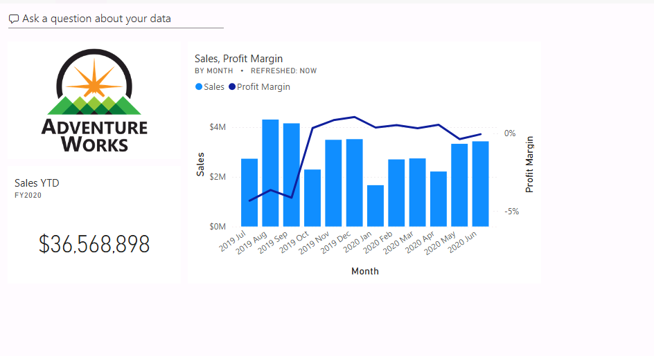
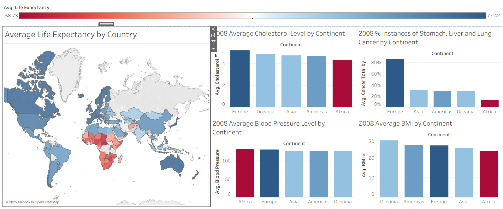

# Data-analytics-bootcamp

# Week 2: Data Visualization \& Exploratory Analysis

**Focus:** Mastering Tableau and Power BI for interactive dashboards, and applying EDA techniques to real-world datasets.  

---

## 1. Data Visualization \& Tool Proficiency

### Tableau

\- Evaluated different versions, noting limitations of Tableau Public:

&nbsp; - Mandatory public publishing (not suitable for confidential data)

&nbsp; - Limited data connections (Excel/CSV only)

&nbsp; - Row/size constraints

\- Developed a custom dashboard using \*\*EMSI\_JobChange\_UK\*\* data:

&nbsp; - Bar charts for percentage changes

&nbsp; - UK-based maps to visualise geographic impacts  

### Power BI

\- Completed end-to-end labs in Skillable:

&nbsp; - Getting and loading transformed data into Power BI Desktop

&nbsp; - Designing interactive dashboards for high-level business insights  

### Adventure Works: Sales Performance & Profit Margin Overview

This Power BI dashboard provides a high-level overview of sales performance and profit margin trends over time.

---

## 2. Exploratory Data Analysis (EDA) Projects

### Spotify Trend Analysis

\- Identified music trends: Pop remains the dominant genre

\- Categorised popularity into four tiers (High → Low) and analysed song attributes:

&nbsp; - Shorter durations and lower loudness often correlated with higher popularity

\- Used bar charts and scatter plots to identify correlations between attributes and popularity

### Global Health \& NHS Strategic Analysis

\- Analysed life expectancy and health metrics globally, noting regional disparities

\- Investigated cancer incidence: Europe had higher rates (1990–2008), potentially due to an ageing population

\- Highlighted gender-specific findings relevant for NHS strategy: men had higher cancer rates, but women had lower life expectancy in some contexts

\- Created heat maps to visualise regional health patterns  

### Global Health Indicators: Life Expectancy & Disease Prevalence

This Tableau visualisation explores key global health indicators using heat maps and bar charts to highlight regional patterns and health disparities.

---

## 3. Theoretical Foundations

\- Applied **data types \& variable concepts**: structured vs unstructured data, quantitative vs qualitative variables

\- Followed the **9-step data analysis process**: Problem Hypothesis → Data Collection → Cleaning → Modelling → Visualising → Analysing → Interpreting → Documenting/Communicating

\- Explored **data collection methods**: web scraping for market research, APIs for integrating external services (e.g., social media, weather)

---

## Skills Developed

\- Proficiency in **Tableau** and **Power BI** for creating interactive dashboards

\- Ability to perform **Exploratory Data Analysis (EDA)** on large datasets
\- Understanding of **data types, variable classification, and data structures**

\- Experience in **data collection, cleaning, and transformation**

\- Ability to **visualise trends, patterns, and disparities** effectively using charts, maps, and heatmaps

\- Analytical thinking applied to **business insights and strategic recommendations**

