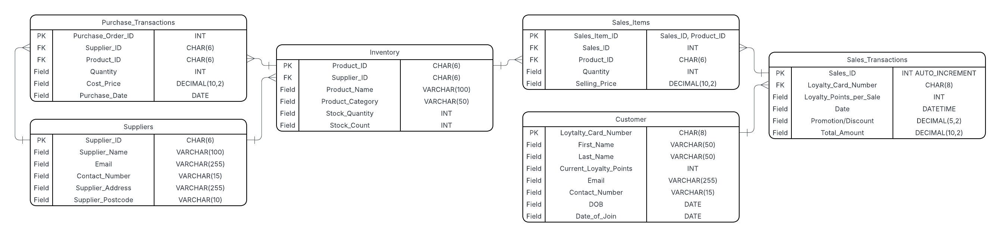

# Data-analytics-bootcamp

# Week 3: SQL \& Database Design

**Focus:** Relational and non-relational databases, database relationships, and SQL querying for analysis.

---

## 1. Key Concepts

\- **Primary \& Foreign Keys**

&nbsp; - Primary Keys uniquely identify records.

&nbsp; - Foreign Keys enforce relationships between tables to maintain data integrity.

\- **Database Relationships**

&nbsp; - One-to-One (Branch ↔ Manager)

&nbsp; - One-to-Many (Regional Manager → Branch Managers)

&nbsp; - Many-to-Many (Marketing Campaigns ↔ Target Audiences)

\- **Relational vs Non-Relational Databases**

&nbsp; - SQL databases: structured, vertical scaling, fixed schemas.

&nbsp; - NoSQL: unstructured, horizontal scaling, flexible schemas, ideal for social media and multimedia data.

\- **JOIN Types**

&nbsp; - INNER, LEFT, RIGHT, FULL, SELF, CROSS joins for combining data across related tables.

---

## 2. Practical Project: Retail Database

\- **ER Diagram: Database Schema**

The ER diagram below illustrates the database schema created for the retail project. It shows how tables are structured, the relationships between them, and the data types used. 

\- This design supports the core operations of the business by enabling:

&nbsp; - Efficient **inventory management** to track products and stock levels

&nbsp; - Recording and analysing **sales transactions**

&nbsp; - Maintaining a **customer loyalty program**

\- **SQL Implementation**

&nbsp; - `CREATE TABLE` and `INSERT INTO` commands to structure and populate data.

\- **Maintenance \& Security**

&nbsp; - Daily differential and weekly full backups.

&nbsp; - Encryption and access controls to protect sensitive customer data.

---

## 3. SQL Querying \& Analysis (world\_db)

\- Performed queries using `SELECT`, `WHERE`, `BETWEEN`, `ORDER BY`, `LIMIT`.

\- Applied aggregate functions (`COUNT`, `MAX`, `AVG`) and aliases.

\- Analysed data by:

&nbsp; - Filtering cities by prefix and population range.

&nbsp; - Calculating average populations and percentages.

&nbsp; - Identifying top and bottom countries by life expectancy.

\- Detected data discrepancies (e.g., Singapore capital population >100%) highlighting the importance of data validation.

---

## Skills Developed

This week focused on understanding how data is structured, related, and queried in real-world business contexts. I combined database theory with practical SQL exercises to design, manage, and analyse relational datasets.

---

## Navigation

[⬅ Back to Main Summary](../README.md) [Next Week ➡](../Week_5_Cloud_Computing_and_Microsoft_Azure/README.md)

