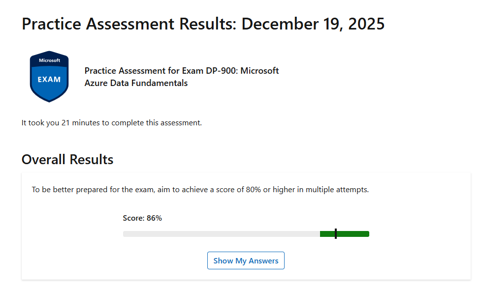
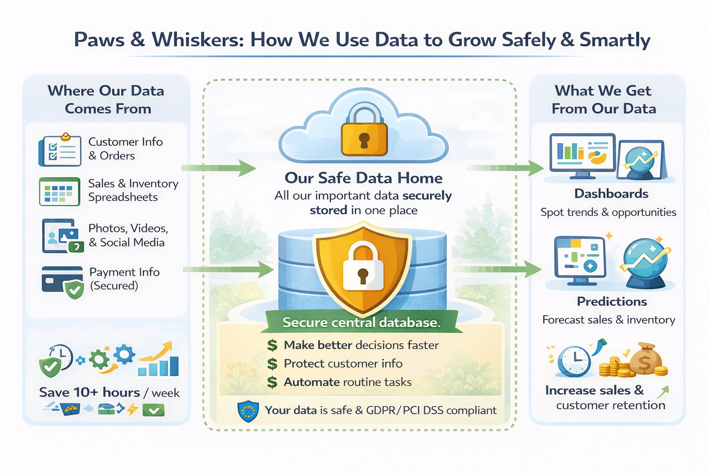

# Data-analytics-bootcamp

# Week 5: Cloud Computing \& Microsoft Azure

**Focus:** Understanding cloud computing foundations, UK legal frameworks for data, hands-on Azure experience, and applying analytics to a real-world business case.

---

## 1. Cloud Computing Foundations

This week, I explored the transition from traditional on-premises hardware to scalable, on-demand cloud resources.

**Service Models:**

\- **IaaS (Infrastructure as a Service):** Renting virtual data centres.  

&nbsp; \*Example:\* Netflix uses AWS for streaming.

\- **PaaS (Platform as a Service):** Provides platforms for rapid application development.  

&nbsp; \*Example:\* Uber uses Google App Engine.

\- **SaaS (Software as a Service):** Ready-to-use web applications.  

&nbsp; \*Example:\* Salesforce.

**Deployment Models:**

\- **Public Cloud:** Shared infrastructure hosted by third-party providers.  

\- **Private Cloud:** Exclusive to a single organization for greater security.  

\- **Hybrid Cloud:** Combines public and private clouds—ideal for organizations needing both scalability and security.  

\- **Community Cloud:** Shared between organizations with similar requirements.

**Cloud Provider Comparison:**
| Provider | Strengths | Example Services |
|----------|-----------|----------------|
| AWS      | Market leader, highly flexible and scalable | EC2, S3, Lambda |
| Azure    | Integrated with Microsoft products | Virtual Machines, SQL Database, Power BI |
| GCP      | Strong in AI, ML, and data analytics | Compute Engine, BigQuery, Cloud Storage |

---

## 2. Legal and Ethical Frameworks

Explored the UK legal landscape for data and IT:

\- **Computer Misuse Act 1990 \& Police and Justice Act 2006:** Covers unauthorised access, intent to commit further offenses, and unauthorized modification. The 2006 update addresses modern threats like DoS attacks and malware distribution.  

\- **Intellectual Property \& Privacy:** Copyright infringement, plagiarism, and risks of using pirated software.  

\- **Data Protection in Employment:** Differentiates employer-permissible data (e.g., NI numbers) from sensitive personal data (e.g., biometrics, health) requiring explicit consent.

---

## 3. Microsoft Azure Technical Proficiency

Hands-on labs and exam preparation strengthened Azure skills:

\- **Azure Labs:** Explored relational and non-relational databases, data analytics, and mapping visualisations.  

\- **DP-900 Practice Exam:** Validated knowledge of cloud data fundamentals and Azure services.

**Screenshot of DP-900 Practice Assessment Results:**

---

## 4. Strategic Case Study: \*Paws \& Whiskers\*

A retail pet shop moving from spreadsheets to a centralised Azure data platform.

**Project Highlights:**

\- **Architecture Design:** Data Lake Storage for structured and unstructured data (sales, customer photos, social media trends).  

\- **Automation \& Integration:** Azure Data Factory for ETL; Azure Functions for event-driven processes like inventory alerts.  

\- **Data Modelling:** Star Schema to relate customer, product, and transaction data; enables real-time insights via Power BI dashboards.  

\- **Security \& Recovery:** Disaster Recovery with Azure Backup and Site Recovery; ensures GDPR and PCI DSS compliance.

**Visual overview of how Paws & Whiskers centralizes, secures, and leverages data to drive smarter business decisions and improve operational efficiency.**

*Note: This diagram was generated using AI to illustrate the data flow and business benefits in a simplified, non-technical way.*

---

## Skills Developed

\- Cloud service and deployment model evaluation (IaaS, PaaS, SaaS; Public, Private, Hybrid, Community)  

\- Understanding UK legal and ethical frameworks around data use  

\- Hands-on Azure experience: relational \& non-relational data, analytics, and visualisation  

\- Practical application of cloud-based data architecture for real business scenarios  

---

## Navigation

[⬅ Back to Main Summary](../README.md) [Next Week ➡](../Week_6_Python_Programming_and_Data_Analysis_with_Pandas)
