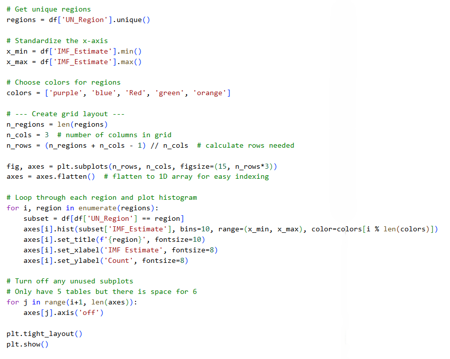
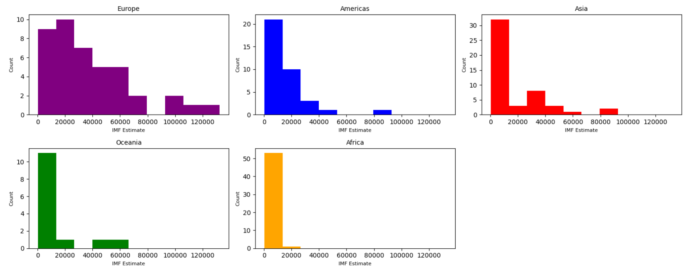

# Data-analytics-bootcamp

# Week 6: Python Programming \& Data Analysis with Pandas

**Focus:** Developing core Python programming skills and applying them to real-world data manipulation and analysis using the Pandas library.

---

## 1. Python Programming Fundamentals

During the week, I covered core programming concepts and Python fundamentals, including:

\- **Data structures and containers:** variables storing single values, lists, dictionaries, tuples, and sets; understanding mutable vs immutable types; indexing and accessing elements.

\- **Control flow and logic:** conditional statements (`if`, `elif`, `else`), loops, and algorithms supported by flow diagrams.

\- **Functions and I/O:** built-in functions like `print()` and `input()`, user input handling.

\- **Additional concepts:** escape characters, arithmetic operations, and organizing data efficiently within Python.

These foundations provided the necessary skills to solve problems programmatically and prepare datasets for further analysis.

---

## 2. Data Exploration and Manipulation (Pandas)

A major component of the week involved working with CSV datasets using the Pandas library, particularly `student.csv`.

### Data Loading and Inspection

\- Loaded CSV files into DataFrames.

\- Used `.head()`, `.info()`, and `.describe()` to understand data structure and summary statistics.

### Indexing and Filtering

\- Selected specific columns (e.g., `name`, `mark`).

\- Filtered rows based on conditions, such as identifying students within a specific class.

### Data Cleaning

\- Renamed columns (e.g., changing `mark` to `score`).

\- Removed unnecessary columns using the `.drop()` method.

---

## 3. Advanced Data Operations

More advanced techniques were applied to convert raw data into structured insights:

\- **Conditional Columns:**

&nbsp; - Created a `passed` column based on a score threshold (`mark >= 60`).

&nbsp; - Generated a multi-tier `grade` column (A, B, C, D) based on score ranges.

\- **Aggregation and Grouping:**

&nbsp; - Used `.groupby()` to calculate:

&nbsp;   - Mean scores per class  

&nbsp;   - Student counts per class  

&nbsp;   - Average performance by gender  

\- **Pivot Tables and Sorting:**

&nbsp; - Built pivot tables to compare class, gender, and marks.

&nbsp; - Sorted datasets to identify top-performing students.

\- **Data Exporting:**

&nbsp; - Exported cleaned and transformed DataFrames back to CSV for external use.

---

## 4. Real-World Analysis: Global GDP Exploration

The week concluded with a real-world data analysis task using the **GDP (nominal) per Capita.csv** dataset.

\- **Regional Analysis:**

&nbsp; - Analysed GDP by `Country/Territory` and `UN\_Region`.

&nbsp; - Compared economic performance across regions.

\- **Exploratory Data Analysis (EDA):**

&nbsp; - Inspected top 10 and bottom 5 rows to identify economic outliers and trends.

\- **Visualisation:**

  - Created charts and plots (bar charts, histograms, and line charts) to explore distributions, compare student performance, and highlight trends.

  - Used visualisations to support insights and make data more interpretable for stakeholders.

## Regional GDP Distribution Visualisation

To explore global economic trends, I created histograms of GDP (nominal) per capita estimates for each UN region. 

---

## Skills Developed

\- Python programming fundamentals (data structures, control flow, functions, algorithms)

\- Data manipulation with Pandas

\- Data cleaning and transformation

\- Aggregation, grouping, and pivot table analysis

\- Exploratory Data Analysis (EDA)

